# Lost & Found Management System — Documentation

## 1. Overview of the Application

The **Lost & Found Management System** is a full-stack web application built with **Angular (frontend)** and **Spring Boot (backend)** that enables users to:
- Report **lost** or **found** items
- Search and browse items
- Automatically (or manually) match lost and found items
- Securely submit and review **claims** for recovered belongings
- Support admin/moderator workflows for verification and approval

---

## 1.1 Functional Requirements

### User & Authentication
- User registration/login
- Role-based access (e.g., USER, ADMIN)
- Profile management

### Item Management
- Create a lost item report
- Create a found item report
- Upload item images (if supported)
- Edit/delete own items (based on permissions)
- View item details

### Search & Discovery
- Search items by keyword
- Filter by category, date, location, status
- Sort results

### Matching
- Suggest matches between lost and found listings (rules/ML/heuristics depending on implementation)
- Allow users/admins to confirm matches

### Claim Workflow
- Submit a claim on a found item
- Review claim (admin/moderator)
- Approve/reject claim
- Track claim status

### Admin/Moderation
- View all users/items/claims
- Moderate content (remove spam/inappropriate content)
- Manage categories/tags (optional)

---

## 1.2 Non-Functional Requirements

- **Security**
  - Authentication and authorization (JWT/session-based)
  - Input validation, OWASP protections
  - Secure storage for secrets (env variables)
- **Performance**
  - Fast search and listing pages
  - Pagination for large datasets
- **Reliability**
  - Consistent API responses
  - Error handling + meaningful status codes
- **Maintainability**
  - Clean layering: controllers → services → repositories
  - DTOs for API boundaries
- **Scalability**
  - Stateless backend (when possible)
  - Database indexing for search fields
- **Observability**
  - Logging (request + error logs)
  - Basic metrics/health endpoints (optional)

---

## 2. Architecture Diagram

---

## 3. User Flow Diagram

---

## 4. Database ER Diagram

---

## 5. Implementation Details

## 5.1 Technologies

### Frontend
- Angular
- TypeScript
- HTML/CSS
- (Optional) Angular Material / Bootstrap (if used)

### Backend
- Java
- Spring Boot (Web, Validation, Security, Data JPA)

### Database
- Relational DB (e.g., MySQL/PostgreSQL/H2 depending on environment)

### API / Documentation
- OpenAPI 3.0 spec (YAML)

### DevOps
- Maven/Gradle (backend build)
- Node/NPM (frontend build)

---

## 6. OpenAPI Spec

The API contract is available here:

- [OpenAPI YAML](./openapi/openapi.yaml)

---
